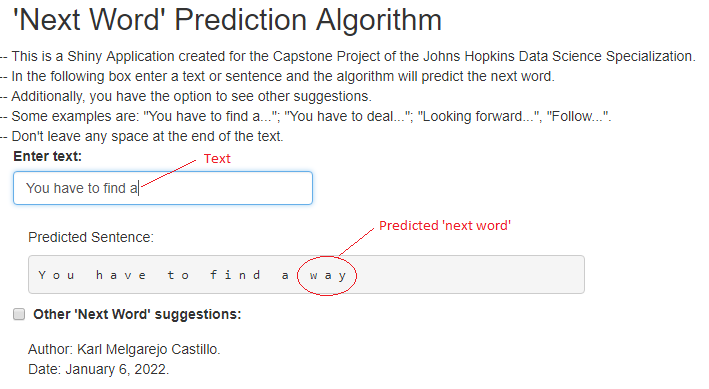

A Web Application for a ''Next Word" Prediction Algorithm
========================================================
author: Karl Melgarejo Castillo
date: January 6, 2022.
autosize: true

About the Application
========================================================

- This web app was built to show the main features of a *'next word' prediction algorithm* for any given text.

- The algorithm uses a *n-gram* model, which consists of using large text databases to analyze how continuous sequences of words are usually structured in lines, paragraphs and documents.

- The sequences of words in this *n-gram* model have a length of 4, 3, and 2 words. And only 1,000 sequences are used in this app due to storage limitations of the free Shiny-App web page, where the app is hosted.   

- The model starts with a sequence of the 3 last words, then with the last 2, and finally with the last word if it was not possible to give a prediction. If the sentence is smaller than 3 words, it starts with the last 2 or 1 word.  

- The app can be accessed from the following link: https://karlmc83.shinyapps.io/CapstoneProject/. More technical details are explained in the following report https://rpubs.com/Karl83/853680

How to use it
========================================================

- First you have to enter a text in the box "Enter text", as it is shown in the next slide.

- After some seconds the app will show a prediction for the next word in the new box "Predicted sentence"

- This is the prediction with the highest probability in the *n-gram* model, for the sequence of the last 3, 2 or 1 word of the given text (this was explained in the previous slide).

- Additionally, the app has the option to show other suggestions for the predicted *next word*.

- The app will show the next 5 most likely words, according to their probabilities calculated in the *n-gram* model. This is shown in the last slide.

- The app will show a *"NA"* when it was not possible to give a prediction. This can occur due to the limited number of sequences used in this app (as was explained before) or because the sequence given is unusual in the database used. 

Prediction: next word
========================================================

- Enter some text as it is shown in the figure and the app will show the prediction after some seconds.

Prediction: other suggestions
========================================================

- After clicking in the optional box, the app will show other suggestions for the *next word* prediction.

